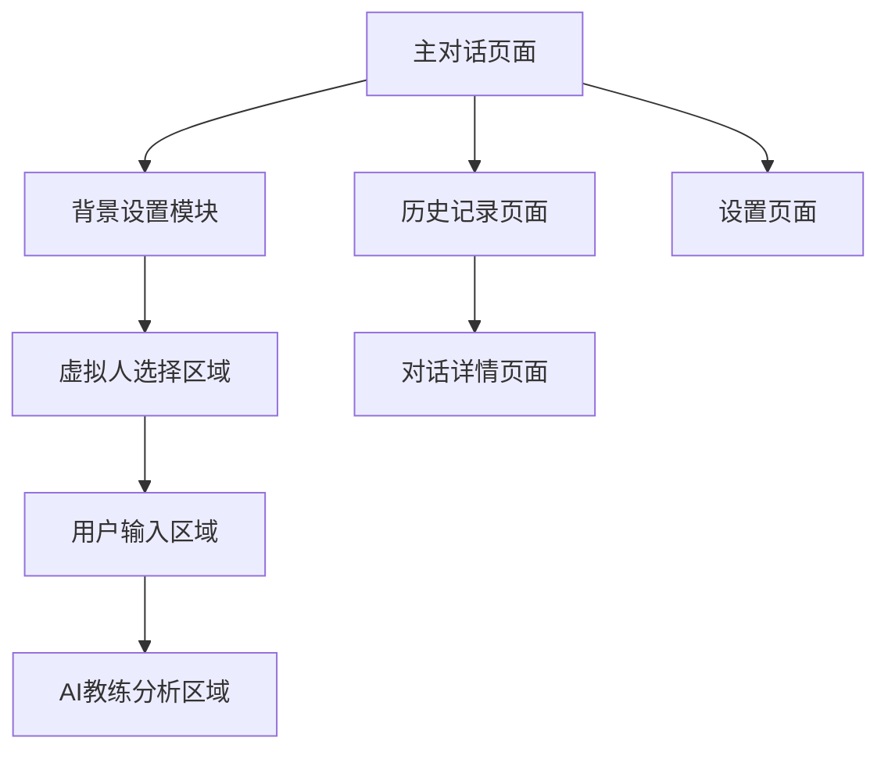

# Gemini交互界面优化 - 产品需求文档

## 1. 产品概述

本项目旨在全面优化Gemini交互界面的用户体验和功能响应机制，通过采用Apple官网极简美学风格的设计理念，重构界面布局和交互流程，提升用户满意度和系统可靠性。

项目将重点解决当前界面布局不够直观、响应路由不稳定、用户体验不够流畅等核心问题，打造一个高效、美观、易用的AI交互平台。

## 2. 核心功能

### 2.1 用户角色

| 角色 | 使用方式 | 核心权限 |
|------|----------|----------|
| 普通用户 | 直接访问 | 可使用基础对话功能，选择虚拟人角色，设置对话背景 |
| 高级用户 | 账户升级 | 可访问高级AI教练功能，查看历史记录，导出对话数据 |

### 2.2 功能模块

我们的Gemini交互界面优化需求包含以下主要页面：

1. **主对话页面**：居中对称式布局、虚拟人选择区域、用户输入区域、AI教练分析区域
2. **背景设置页面**：场景配置模块、预设模板选择、自定义背景输入
3. **历史记录页面**：对话历史列表、搜索筛选功能、数据导出选项
4. **设置页面**：界面主题切换、响应参数调整、无障碍功能配置

### 2.3 页面详情

| 页面名称 | 模块名称 | 功能描述 |
|----------|----------|----------|
| 主对话页面 | 虚拟人选择区域 | 提供角色下拉选择，显示角色头像和描述，支持快速切换 |
| 主对话页面 | 用户输入区域 | 多行文本输入框，实时字数统计，快捷发送按钮，输入状态提示 |
| 主对话页面 | AI教练分析区域 | 实时情绪分析，沟通建议展示，冲突等级评估，改进方案推荐 |
| 主对话页面 | 背景设置模块 | 场景描述输入，背景锁定功能，预设模板选择，状态确认提示 |
| 历史记录页面 | 对话列表 | 按时间排序显示，支持分页加载，快速预览功能，删除和编辑操作 |
| 历史记录页面 | 搜索筛选 | 关键词搜索，日期范围筛选，角色类型过滤，标签分类查看 |
| 设置页面 | 界面配置 | 主题色彩切换，字体大小调整，布局密度设置，动画效果开关 |
| 设置页面 | 功能参数 | 响应延迟设置，内容长度限制，错误重试次数，自动保存间隔 |

## 3. 核心流程

**普通用户流程：**
用户进入主对话页面 → 设置对话背景并锁定 → 选择虚拟人角色 → 开始输入对话内容 → 查看AI回复和教练分析 → 继续对话或结束会话

**高级用户流程：**
用户登录账户 → 访问历史记录查看过往对话 → 进入主对话页面 → 使用高级功能进行深度分析 → 导出对话数据或分享结果

## 4. 用户界面设计

### 4.1 设计风格

**主要色彩方案：**
- 主色调：深蓝渐变 (#1e293b → #0f172a)
- 辅助色：橙色系 (#f97316, #ea580c) 用于强调和确认操作
- 功能色：绿色 (#10b981) 用于用户输入，蓝色 (#3b82f6) 用于AI回复

**按钮样式：**
- 采用圆角矩形设计 (8px border-radius)
- 渐变背景效果，悬停时加深色彩
- 微妙的阴影和光晕效果

**字体和排版：**
- 主要字体：系统默认字体栈，确保跨平台一致性
- 标题字号：18px (font-semibold)
- 正文字号：14px (font-normal)
- 辅助信息：12px (font-light)

**布局风格：**
- 采用卡片式布局，增强内容层次感
- 居中对称式设计，保持视觉平衡
- 充分利用留白，营造简洁美观的视觉效果

**图标风格：**
- 使用Lucide图标库，保持风格统一
- 16px标准尺寸，重要操作使用20px
- 支持主题色彩适配

### 4.2 页面设计概览

| 页面名称 | 模块名称 | UI元素 |
|----------|----------|--------|
| 主对话页面 | 整体布局 | 深蓝渐变背景，毛玻璃效果卡片，白色半透明边框，居中对称式三栏布局 |
| 主对话页面 | 虚拟人选择区域 | 下拉选择器，角色头像圆形设计，蓝色渐变背景，动画过渡效果 |
| 主对话页面 | 用户输入区域 | 多行文本框，绿色主题色，实时字数统计，发送按钮渐变效果 |
| 主对话页面 | AI教练分析区域 | 折叠面板设计，橙色强调色，图表可视化，建议列表展示 |
| 背景设置模块 | 输入界面 | 大型文本区域，橙色确认按钮，锁定状态图标，状态提示文字 |
| 历史记录页面 | 列表展示 | 时间轴布局，卡片式对话预览，悬停效果，分页导航 |

### 4.3 响应式设计

本产品采用桌面优先的设计策略，同时兼顾移动端适配：

- **桌面端 (≥1024px)：** 三栏布局，充分利用屏幕空间
- **平板端 (768px-1023px)：** 两栏布局，部分功能折叠显示
- **移动端 (<768px)：** 单栏垂直布局，支持触摸手势操作

界面支持触摸交互优化，包括滑动切换、长按菜单、双击放大等移动端特有的交互方式。