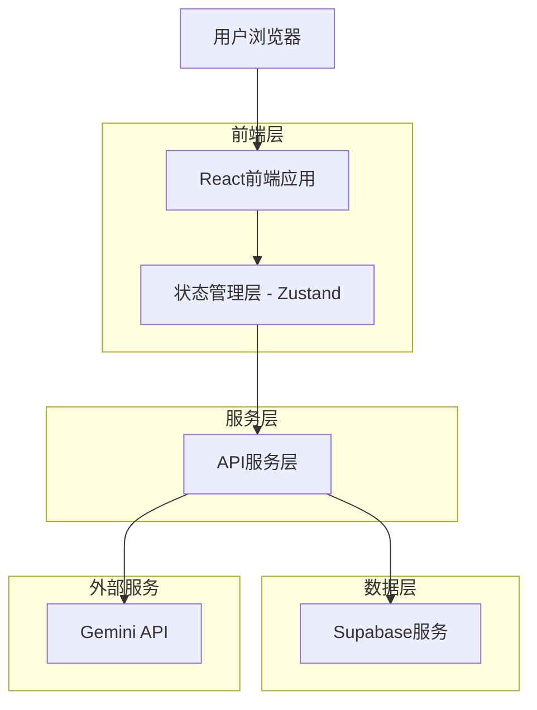
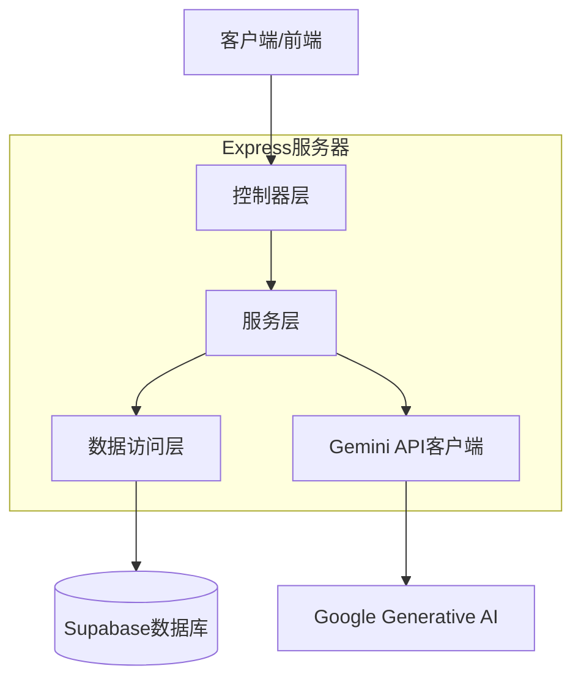
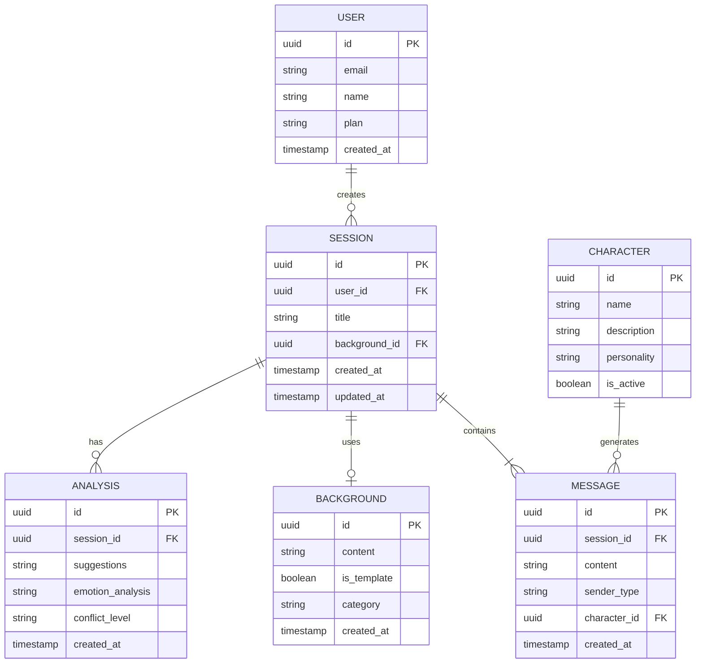

# Gemini交互界面优化 - 技术架构文档

## 1. 架构设计



## 2. 技术描述

- **前端**: React@18 + TypeScript + Tailwind CSS@3 + Framer Motion + Vite
- **状态管理**: Zustand
- **后端**: Node.js + Express@4
- **数据库**: Supabase (PostgreSQL)
- **API集成**: Google Generative AI SDK
- **UI组件**: 自定义组件库 + Lucide Icons
- **测试工具**: Vitest + Testing Library + Playwright

## 3. 路由定义

| 路由 | 用途 |
|------|------|
| / | 主对话页面，包含虚拟人对话、用户输入和AI教练分析功能 |
| /history | 历史记录页面，展示用户过往对话记录和分析结果 |
| /settings | 设置页面，提供界面和功能参数配置选项 |
| /templates | 背景模板页面，提供预设对话场景选择 |

## 4. API定义

### 4.1 对话相关API

虚拟人回复生成
```
POST /api/chat/reply
```

请求参数:
| 参数名 | 参数类型 | 是否必须 | 描述 |
|--------|----------|----------|------|
| userMessage | string | 是 | 用户输入的消息内容 |
| background | string | 是 | 当前对话背景描述 |
| characterId | string | 是 | 所选虚拟人角色ID |
| sessionId | string | 否 | 会话ID，用于继续对话 |

响应参数:
| 参数名 | 参数类型 | 描述 |
|--------|----------|------|
| success | boolean | 请求是否成功 |
| message | string | AI生成的回复内容 |
| messageId | string | 消息唯一标识符 |
| timestamp | number | 消息生成时间戳 |

示例:
```json
{
  "userMessage": "我觉得你根本不理解我的感受",
  "background": "因为家务分配问题产生争执",
  "characterId": "char_defensive_partner"
}
```

### 4.2 教练分析API

对话分析生成
```
POST /api/coach/analyze
```

请求参数:
| 参数名 | 参数类型 | 是否必须 | 描述 |
|--------|----------|----------|------|
| conversation | string | 是 | 完整对话历史 |
| currentMessage | string | 是 | 当前用户消息 |
| sessionId | string | 否 | 会话ID |

响应参数:
| 参数名 | 参数类型 | 描述 |
|--------|----------|------|
| success | boolean | 请求是否成功 |
| suggestions | string[] | 沟通建议列表 |
| emotion_analysis | string | 情绪分析结果 |
| conflict_level | string | 冲突等级评估 |

## 5. 服务器架构图



## 6. 数据模型

### 6.1 数据模型定义



### 6.2 数据定义语言

用户表 (users)
```sql
-- 创建用户表
CREATE TABLE users (
  id UUID PRIMARY KEY DEFAULT gen_random_uuid(),
  email VARCHAR(255) UNIQUE NOT NULL,
  name VARCHAR(100) NOT NULL,
  plan VARCHAR(20) DEFAULT 'free' CHECK (plan IN ('free', 'premium')),
  created_at TIMESTAMP WITH TIME ZONE DEFAULT NOW()
);

-- 创建索引
CREATE INDEX idx_users_email ON users(email);
```

会话表 (sessions)
```sql
-- 创建会话表
CREATE TABLE sessions (
  id UUID PRIMARY KEY DEFAULT gen_random_uuid(),
  user_id UUID REFERENCES users(id),
  title VARCHAR(255) NOT NULL,
  background_id UUID REFERENCES backgrounds(id),
  created_at TIMESTAMP WITH TIME ZONE DEFAULT NOW(),
  updated_at TIMESTAMP WITH TIME ZONE DEFAULT NOW()
);

-- 创建索引
CREATE INDEX idx_sessions_user_id ON sessions(user_id);
CREATE INDEX idx_sessions_created_at ON sessions(created_at DESC);
```

消息表 (messages)
```sql
-- 创建消息表
CREATE TABLE messages (
  id UUID PRIMARY KEY DEFAULT gen_random_uuid(),
  session_id UUID REFERENCES sessions(id),
  content TEXT NOT NULL,
  sender_type VARCHAR(20) CHECK (sender_type IN ('user', 'ai')),
  character_id UUID REFERENCES characters(id),
  created_at TIMESTAMP WITH TIME ZONE DEFAULT NOW()
);

-- 创建索引
CREATE INDEX idx_messages_session_id ON messages(session_id);
CREATE INDEX idx_messages_created_at ON messages(created_at);
```

角色表 (characters)
```sql
-- 创建角色表
CREATE TABLE characters (
  id UUID PRIMARY KEY DEFAULT gen_random_uuid(),
  name VARCHAR(100) NOT NULL,
  description VARCHAR(255) NOT NULL,
  personality TEXT NOT NULL,
  is_active BOOLEAN DEFAULT TRUE,
  created_at TIMESTAMP WITH TIME ZONE DEFAULT NOW()
);

-- 初始数据
INSERT INTO characters (name, description, personality, is_active)
VALUES 
  ('固执伴侣', '不愿意让步的伴侣角色', '固执、坚持己见、不易妥协、容易情绪化', TRUE),
  ('理性朋友', '注重逻辑思考的朋友角色', '冷静、理性、分析型思维、不易被情绪影响', TRUE),
  ('情绪化家人', '容易情绪波动的家庭成员', '敏感、情绪化、容易受伤、表达直接', TRUE);
```

背景表 (backgrounds)
```sql
-- 创建背景表
CREATE TABLE backgrounds (
  id UUID PRIMARY KEY DEFAULT gen_random_uuid(),
  content TEXT NOT NULL,
  is_template BOOLEAN DEFAULT FALSE,
  category VARCHAR(50),
  created_at TIMESTAMP WITH TIME ZONE DEFAULT NOW()
);

-- 初始模板数据
INSERT INTO backgrounds (content, is_template, category)
VALUES 
  ('因为家务分配问题产生争执', TRUE, '家庭'),
  ('对未来规划有不同看法', TRUE, '关系'),
  ('工作中的责任分配不均', TRUE, '职场');
```

分析表 (analyses)
```sql
-- 创建分析表
CREATE TABLE analyses (
  id UUID PRIMARY KEY DEFAULT gen_random_uuid(),
  session_id UUID REFERENCES sessions(id),
  suggestions JSONB NOT NULL,
  emotion_analysis TEXT NOT NULL,
  conflict_level VARCHAR(20) CHECK (conflict_level IN ('low', 'medium', 'high')),
  created_at TIMESTAMP WITH TIME ZONE DEFAULT NOW()
);

-- 创建索引
CREATE INDEX idx_analyses_session_id ON analyses(session_id);
```

-- 设置权限
```sql
-- 授予基本读取权限给匿名角色
GRANT SELECT ON characters TO anon;
GRANT SELECT ON backgrounds TO anon;

-- 授予完全权限给已认证角色
GRANT ALL PRIVILEGES ON users TO authenticated;
GRANT ALL PRIVILEGES ON sessions TO authenticated;
GRANT ALL PRIVILEGES ON messages TO authenticated;
GRANT ALL PRIVILEGES ON characters TO authenticated;
GRANT ALL PRIVILEGES ON backgrounds TO authenticated;
GRANT ALL PRIVILEGES ON analyses TO authenticated;
```