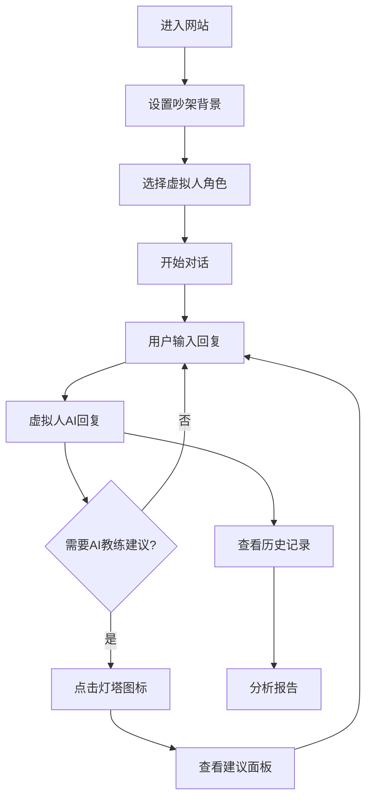

# 吵架主题互动网站 - 产品需求文档

## 1. 产品概述

一个基于AI技术的吵架主题互动网站，通过虚拟人对话和AI教练指导，帮助用户在安全的环境中练习沟通技巧和情绪管理。
- 解决现实生活中缺乏安全练习冲突处理技能的问题，为需要提升沟通能力的用户提供模拟训练平台。
- 目标市场价值：为个人成长、情商训练和沟通技能提升提供创新的AI辅助解决方案。

## 2. 核心功能

### 2.1 用户角色

| 角色 | 注册方法 | 核心权限 |
|------|----------|----------|
| 普通用户 | 免注册直接使用 | 可进行基础对话练习，查看对话历史 |
| 注册用户 | 邮箱注册 | 可保存个人设置，访问高级角色，获得详细分析报告 |

### 2.2 功能模块

我们的吵架主题互动网站包含以下主要页面：
1. **主对话页面**：左右分栏布局，虚拟人对话区域，真人输入区域，顶部背景设置，底部AI教练
2. **历史记录页面**：对话历史查看，分析报告展示
3. **设置页面**：角色管理，个人偏好设置

### 2.3 页面详情

| 页面名称 | 模块名称 | 功能描述 |
|----------|----------|----------|
| 主对话页面 | 虚拟人对话区域 | 显示AI虚拟人头像和对话气泡，角色选择下拉框，实时对话展示 |
| 主对话页面 | 真人输入区域 | 文本输入框支持多行输入，发送按钮，输入状态提示 |
| 主对话页面 | 吵架背景模块 | 背景描述输入框，确认按钮，背景锁定状态显示 |
| 主对话页面 | AI教练模块 | 灯塔图标交互，手电筒照射动画，建议面板浮层，实时分析提示 |
| 历史记录页面 | 对话历史列表 | 按时间排序的对话记录，搜索和筛选功能 |
| 历史记录页面 | 分析报告 | 情绪分析图表，沟通技巧评分，改进建议 |
| 设置页面 | 角色管理 | 虚拟人角色库，自定义角色创建，角色特性设置 |
| 设置页面 | 个人偏好 | 界面主题设置，通知偏好，隐私设置 |

## 3. 核心流程

**主要用户操作流程：**
用户进入网站 → 设置吵架背景描述 → 选择虚拟人角色身份 → 开始对话互动 → 实时获得AI教练建议 → 查看对话分析报告

**详细交互流程：**
1. 用户在顶部输入吵架背景并确认锁定
2. 在左侧选择虚拟人角色（如：愤怒的同事、固执的家人等）
3. 在右侧输入框输入回复内容并发送
4. 虚拟人基于角色设定和背景进行AI回复
5. 用户可随时点击底部灯塔图标获得AI教练的沟通建议
6. 对话结束后可查看完整的分析报告和改进建议

## 4. 用户界面设计

### 4.1 设计风格

- **主色调**：深蓝色 (#1a365d) 和橙色 (#ed8936)，营造专业而温暖的氛围
- **辅助色**：浅灰色 (#f7fafc) 背景，白色 (#ffffff) 卡片
- **按钮风格**：圆角矩形按钮，悬停时有渐变效果和阴影
- **字体**：主标题使用 18-24px 粗体，正文使用 14-16px 常规字体
- **布局风格**：卡片式设计，顶部导航栏，响应式网格布局
- **图标风格**：线性图标配合实心图标，灯塔图标采用发光效果

### 4.2 页面设计概览

| 页面名称 | 模块名称 | UI元素 |
|----------|----------|---------|
| 主对话页面 | 虚拟人对话区域 | 左侧固定宽度40%，虚拟人头像圆形设计，对话气泡采用渐变背景，角色选择下拉框位于顶部 |
| 主对话页面 | 真人输入区域 | 右侧固定宽度40%，多行文本框带圆角边框，发送按钮采用主色调，输入计数器显示 |
| 主对话页面 | 吵架背景模块 | 顶部全宽度，输入框高度60px，确认按钮右对齐，锁定后显示灰色禁用状态 |
| 主对话页面 | AI教练模块 | 底部居中，灯塔图标32px大小，点击后触发黄色光束动画，建议面板采用毛玻璃效果 |
| 历史记录页面 | 对话历史列表 | 卡片式布局，每个对话记录显示时间、背景摘要和参与角色 |
| 设置页面 | 角色管理 | 网格布局展示角色卡片，每个角色显示头像、名称和简介 |

### 4.3 响应式设计

桌面优先设计，移动端自适应布局。在移动设备上，左右分栏改为上下布局，保持触摸交互优化，灯塔图标增大至48px以便触摸操作。