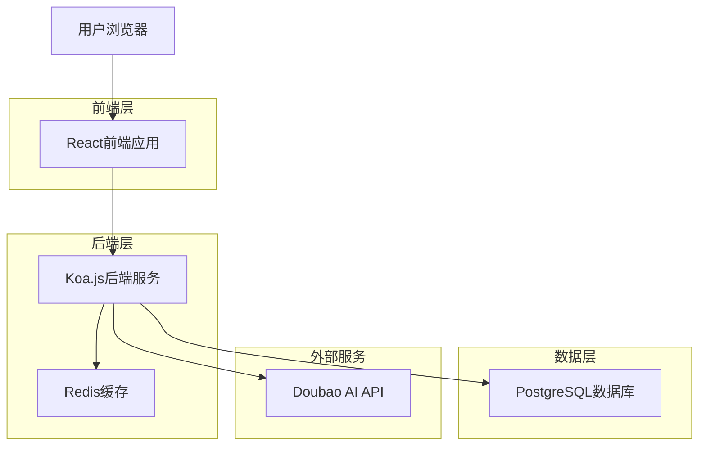
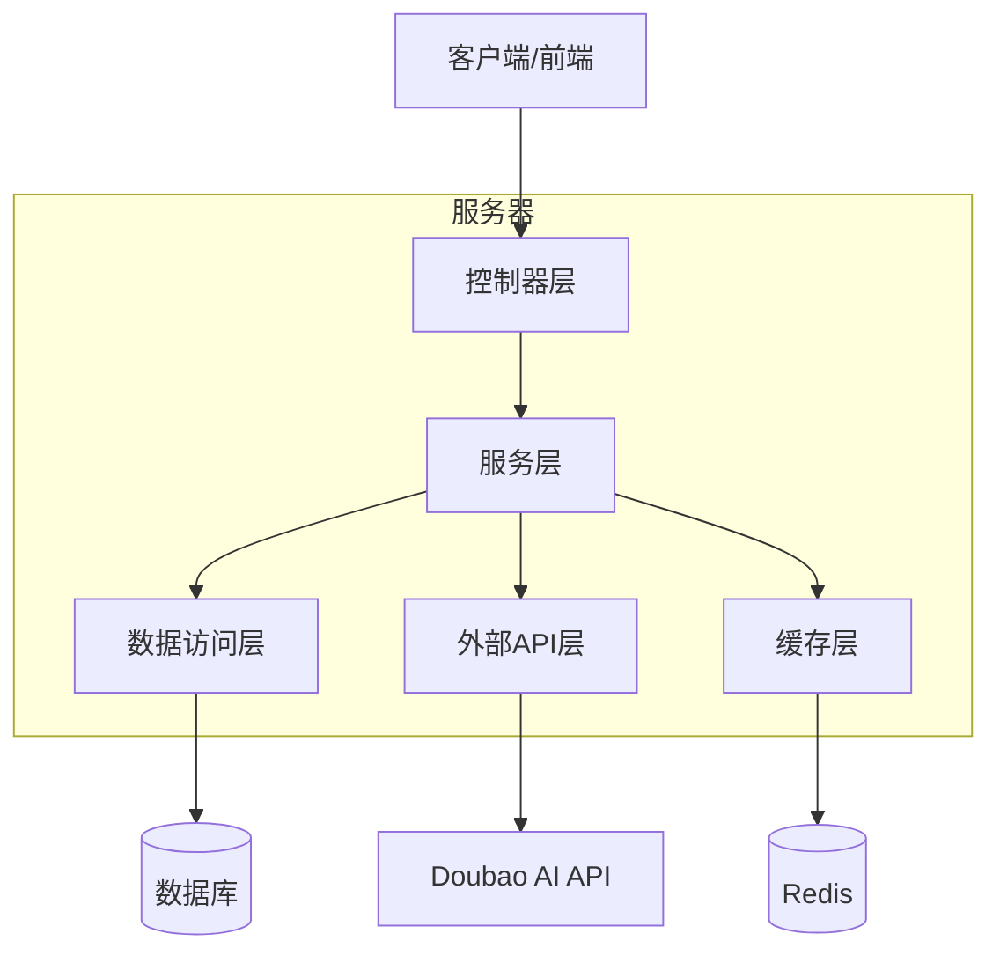
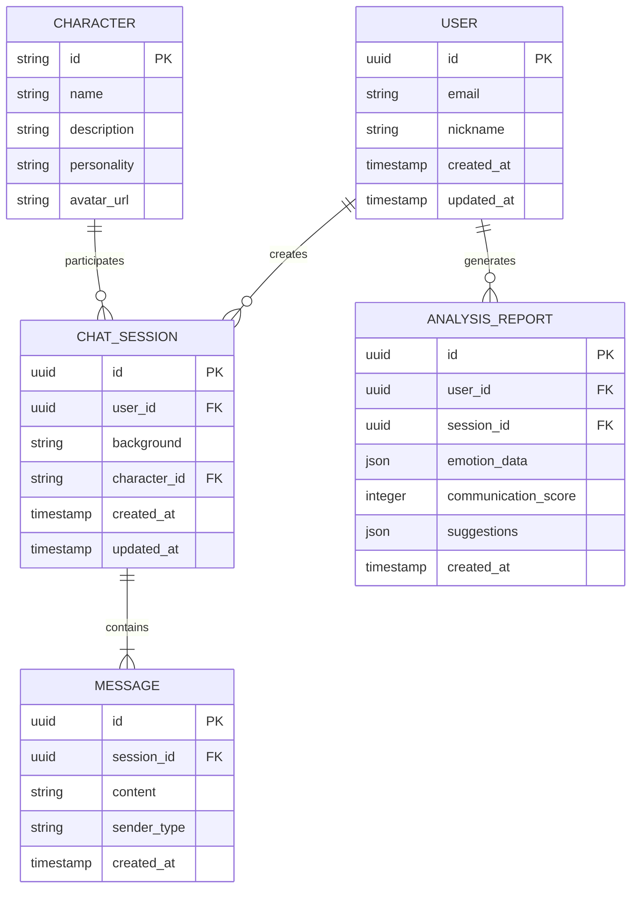

# 吵架主题互动网站 - 技术架构文档

## 1. 架构设计



## 2. 技术描述

- 前端: React@18 + TypeScript@5 + Vite@5 + TailwindCSS@3 + Framer Motion@10
- 后端: Node.js@18 + Koa.js@3 + TypeScript@5
- 数据库: PostgreSQL@15 (通过 pg 客户端连接)
- 缓存: Redis@7 (用于会话管理和API调用缓存)
- AI服务: Doubao AI API (字节跳动豆包大模型)

## 3. 路由定义

| 路由 | 用途 |
|------|-----|
| / | 主对话页面，包含虚拟人对话、用户输入、背景设置和AI教练模块 |
| /history | 历史记录页面，显示用户的对话历史和分析报告 |
| /settings | 设置页面，管理虚拟人角色和个人偏好设置 |

## 4. API定义

### 4.1 核心API

**对话相关接口**

```
POST /api/chat/send
```

请求:
| 参数名称 | 参数类型 | 是否必需 | 描述 |
|----------|----------|----------|------|
| message | string | true | 用户输入的消息内容 |
| background | string | true | 吵架背景描述 |
| character | string | true | 虚拟人角色ID |
| sessionId | string | true | 会话ID |

响应:
| 参数名称 | 参数类型 | 描述 |
|----------|----------|------|
| reply | string | AI虚拟人的回复内容 |
| sessionId | string | 会话ID |
| timestamp | number | 回复时间戳 |

示例:
```json
{
  "message": "你这样说话太过分了！",
  "background": "因为工作分配问题产生争执",
  "character": "angry_colleague",
  "sessionId": "session_123"
}
```

**AI教练建议接口**

```
POST /api/coach/analyze
```

请求:
| 参数名称 | 参数类型 | 是否必需 | 描述 |
|----------|----------|----------|------|
| conversation | array | true | 对话历史数组 |
| currentMessage | string | true | 当前用户消息 |

响应:
| 参数名称 | 参数类型 | 描述 |
|----------|----------|------|
| suggestions | array | AI教练的建议列表 |
| emotionAnalysis | object | 情绪分析结果 |
| communicationScore | number | 沟通技巧评分 |

**角色管理接口**

```
GET /api/characters
```

响应:
| 参数名称 | 参数类型 | 描述 |
|----------|----------|------|
| characters | array | 可用虚拟人角色列表 |

**对话历史接口**

```
GET /api/history/:userId
```

响应:
| 参数名称 | 参数类型 | 描述 |
|----------|----------|------|
| sessions | array | 用户的对话会话列表 |
| totalCount | number | 总对话数量 |

## 5. 服务器架构图



## 6. 数据模型

### 6.1 数据模型定义



### 6.2 数据定义语言

**用户表 (users)**
```sql
-- 创建用户表
CREATE TABLE users (
    id UUID PRIMARY KEY DEFAULT gen_random_uuid(),
    email VARCHAR(255) UNIQUE,
    nickname VARCHAR(100) NOT NULL,
    created_at TIMESTAMP WITH TIME ZONE DEFAULT NOW(),
    updated_at TIMESTAMP WITH TIME ZONE DEFAULT NOW()
);

-- 创建索引
CREATE INDEX idx_users_email ON users(email);
CREATE INDEX idx_users_created_at ON users(created_at DESC);
```

**虚拟人角色表 (characters)**
```sql
-- 创建角色表
CREATE TABLE characters (
    id VARCHAR(50) PRIMARY KEY,
    name VARCHAR(100) NOT NULL,
    description TEXT NOT NULL,
    personality TEXT NOT NULL,
    avatar_url VARCHAR(500),
    created_at TIMESTAMP WITH TIME ZONE DEFAULT NOW()
);

-- 初始化角色数据
INSERT INTO characters (id, name, description, personality, avatar_url) VALUES
('angry_colleague', '愤怒的同事', '工作中容易激动的同事角色', '急躁、直接、容易情绪化，但内心关心工作效率', '/avatars/angry_colleague.png'),
('stubborn_family', '固执的家人', '家庭中比较固执己见的长辈', '传统、坚持己见、经验丰富，但关爱家人', '/avatars/stubborn_family.png'),
('defensive_friend', '防御性朋友', '容易产生防御心理的朋友', '敏感、自我保护意识强，但重视友情', '/avatars/defensive_friend.png');
```

**对话会话表 (chat_sessions)**
```sql
-- 创建对话会话表
CREATE TABLE chat_sessions (
    id UUID PRIMARY KEY DEFAULT gen_random_uuid(),
    user_id UUID REFERENCES users(id),
    background TEXT NOT NULL,
    character_id VARCHAR(50) REFERENCES characters(id),
    created_at TIMESTAMP WITH TIME ZONE DEFAULT NOW(),
    updated_at TIMESTAMP WITH TIME ZONE DEFAULT NOW()
);

-- 创建索引
CREATE INDEX idx_chat_sessions_user_id ON chat_sessions(user_id);
CREATE INDEX idx_chat_sessions_created_at ON chat_sessions(created_at DESC);
```

**消息表 (messages)**
```sql
-- 创建消息表
CREATE TABLE messages (
    id UUID PRIMARY KEY DEFAULT gen_random_uuid(),
    session_id UUID REFERENCES chat_sessions(id) ON DELETE CASCADE,
    content TEXT NOT NULL,
    sender_type VARCHAR(20) NOT NULL CHECK (sender_type IN ('user', 'ai')),
    created_at TIMESTAMP WITH TIME ZONE DEFAULT NOW()
);

-- 创建索引
CREATE INDEX idx_messages_session_id ON messages(session_id);
CREATE INDEX idx_messages_created_at ON messages(created_at);
```

**分析报告表 (analysis_reports)**
```sql
-- 创建分析报告表
CREATE TABLE analysis_reports (
    id UUID PRIMARY KEY DEFAULT gen_random_uuid(),
    user_id UUID REFERENCES users(id),
    session_id UUID REFERENCES chat_sessions(id),
    emotion_data JSONB,
    communication_score INTEGER CHECK (communication_score >= 0 AND communication_score <= 100),
    suggestions JSONB,
    created_at TIMESTAMP WITH TIME ZONE DEFAULT NOW()
);

-- 创建索引
CREATE INDEX idx_analysis_reports_user_id ON analysis_reports(user_id);
CREATE INDEX idx_analysis_reports_session_id ON analysis_reports(session_id);
CREATE INDEX idx_analysis_reports_score ON analysis_reports(communication_score DESC);
```